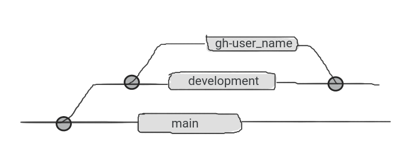

# Contribution guide

## ▨ Branching
the project contains three mejor branch.
+ **main** (This is the stable branch)
+ **development** (final development commits are here)
+ **gh-username** (for individual contributors)



Please, do not commit any changes to main and development branch. Make separete branch with `gh-` prefix and your `github username` from development and start developing.

----

## ▨ Steps

To contribute this project, follow the steps.

- Fork this project to your account. (make sure you have git installed in your machine and configured properly)
```sh
git clone https://github.com/The-IT-Crew/Database-Management-System.git
```

- Open terminal inside the cloned repo in your local directory, and open terminal.

- Change to the `development` branch.
```sh
git checkout development
```

- Make a sub-branch named `gh-username`. (Example: gh-thesayandey)
```sh
git checkout -b gh-<username> development
```

- Start developing, and commit them.
```sh
git add <filename>
git commit -m "commit message"
```

- After commit changes to your sub-branch. Push them to `developmet` branch.
```sh
git push origin development
git push gh-username
```

- After final contribution to your cloned repo, make a push request to [The-IT-Crew](https://github.com/The-IT-Crew/) main remote reposetory.


#### Any contribution in this project are alwayas welcome.